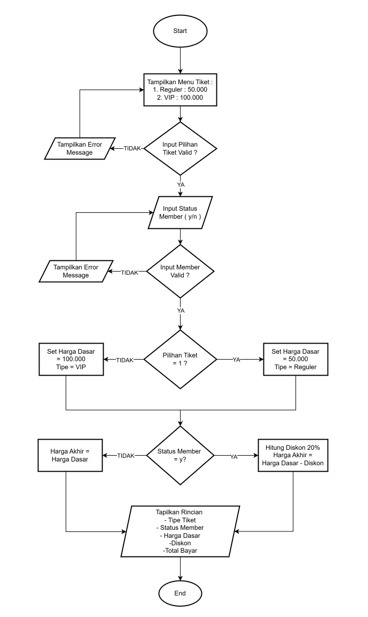

# Data Diri

Nama : Zizantara Arzeva Cakra Kahana

NIM : 312410398

Kelas : TI,24.A.3

# Menghitung Tiket Bioskop

## Flowchart

## Input Program

## Output Program

## Program ini memiliki fitur-fitur berikut:
1. Meminta input tipe tiket (Reguler/VIP)
2. Meminta status member (ya/tidak)
3. Menghitung harga dengan diskon jika user adalah member
4. Menampilkan rincian pembelian lengkap
5. Memiliki validasi input untuk menghindari error
6. Menggunakan format angka dengan pemisah ribuan untuk kemudahan membaca

## Cara menggunakan program:
1. Jalankan program
2. Pilih tipe tiket dengan memasukkan angka 1 (Reguler) atau 2 (VIP)
3. Masukkan status member dengan 'y' untuk ya atau 'n' untuk tidak
4. Program akan menampilkan rincian pembelian dan total yang harus dibayar